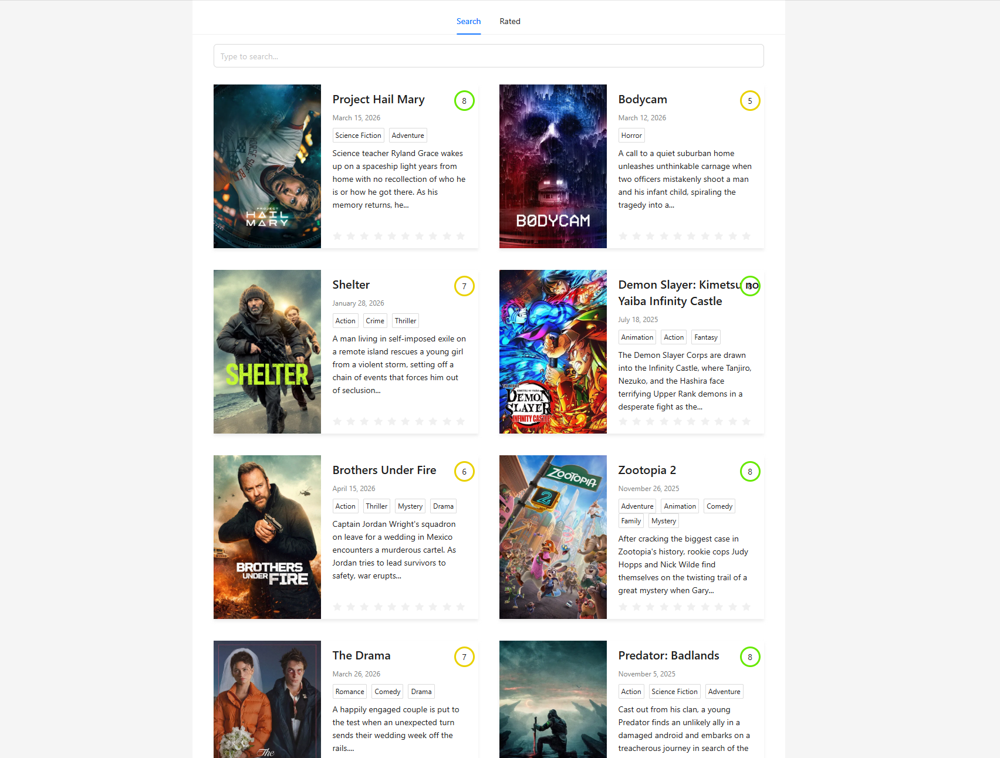
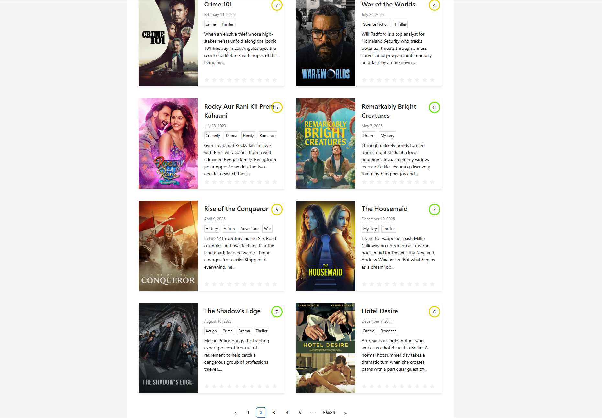
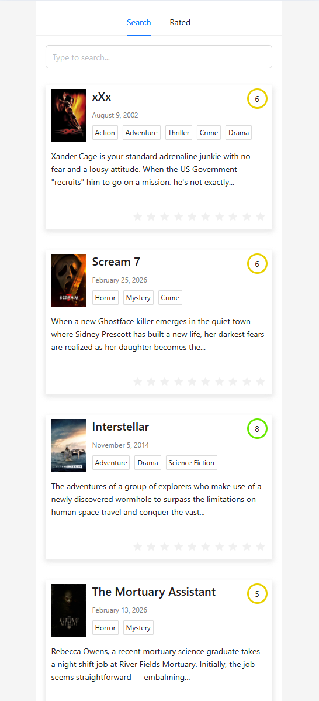

# Movies App

Frontend application for searching movies, viewing details, and saving favorites.

## Features
- Movie search
- API integration
- Dynamic routing
- Favorites
- Responsive layout
- Loading and error states
- Search history
- Favorites persistence

## Tech Stack
- React
- TypeScript
- React Router
- Axios
- REST API
- SCSS
- Vite

## Demo
Live Demo: https://movies-app-sigma-beige.vercel.app/

## Screenshots

### Desktop




### Mobile


## Installation

```bash
npm install
npm run dev
```

## Author
Kseniia Suvorova
